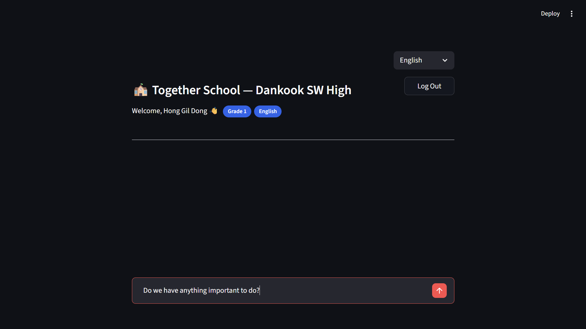

# 단대소고 함께학교 챗봇

다문화 가정 학생 및 학부모를 위한 **다국어 학교생활 안내 RAG 챗봇**입니다.
학교에서 배포한 가정통신문 PDF를 기반으로 질문에 답변하며, 한국어·영어·베트남어·중국어를 지원합니다.

---

## 주요 기능

| 기능 | 설명 |
|---|---|
| 다국어 답변 | 사용자 언어 설정에 따라 GPT가 해당 언어로 답변 |
| RAG 검색 | FAISS 벡터 검색으로 관련 문서 청크 추출 |
| 출처 표시 | 사이드바에 근거 문서 파일명·관련도% 노출 |
| 회원 인증 | 학번 기반 회원가입/로그인, 비밀번호 SHA-256 해시 저장 |
| 대화 기록 | 세션 내 이전 대화 유지 |

---

## 기술 스택

```
UI          Streamlit
LLM         OpenAI GPT-4o-mini
임베딩       OpenAI text-embedding-3-small
벡터 DB      FAISS
RAG 파이프라인 LangChain
문서 파싱    pypdf
```

---

## 프로젝트 구조

```
TogetherSchool/
├── app.py                  # Streamlit 메인 앱 (랜딩·로그인·챗봇 페이지)
├── src/
│   ├── parse_pdfs.py       # PDF → txt 텍스트 추출
│   └── build_index.py      # txt → 청킹 → 임베딩 → FAISS 인덱스 저장
├── data/                   # 추출된 가정통신문 .txt 파일
├── vectorstore/            # FAISS 인덱스 (index.faiss, index.pkl)
├── pictures/               # 화면 스크린샷
├── pdf/                    # 원본 PDF 파일 (git 제외)
├── users/                  # 회원 정보 JSON (git 제외)
├── requirements.txt
└── .env                    # API 키 (git 제외)
```

---

## 시작하기

### 1. 저장소 클론

```bash
git clone https://github.com/jeongheeyoon7379-hub/TogetherSchool.git
cd TogetherSchool
```

### 2. 가상환경 생성 및 패키지 설치

```bash
python -m venv venv

# Windows
.\venv\Scripts\Activate.ps1

# macOS / Linux
source venv/bin/activate

pip install -r requirements.txt
```

### 3. 환경변수 설정

프로젝트 루트에 `.env` 파일을 만들고 아래 내용을 입력합니다.

```
OPENAI_API_KEY=sk-...
```

> OpenAI API 키 발급: https://platform.openai.com/api-keys

### 4. PDF 파싱 및 인덱스 빌드

```bash
# pdf/ 폴더에 가정통신문 PDF를 넣은 후 실행
python src/parse_pdfs.py    # PDF → data/*.txt
python src/build_index.py   # txt → vectorstore/
```

### 5. 앱 실행

```bash
streamlit run app.py
```

브라우저에서 http://localhost:8501 접속

---

## 화면 안내

### 1단계 — 랜딩 페이지


앱에 처음 접속하면 나타나는 화면입니다.
오른쪽 상단의 언어 선택 메뉴(한국어·English·Tiếng Việt·中文)로 UI 표시 언어를 바꿀 수 있습니다.
**Sign Up** 버튼으로 새 계정을 만들거나, **Log In** 버튼으로 기존 계정에 로그인합니다.

---

### 2단계 — 회원가입


**Sign Up** 버튼을 누르면 회원가입 폼이 나타납니다.

| 항목 | 설명 |
|---|---|
| Student ID | 학번 (예: 10101) |
| Name | 이름 |
| Grade | 학년 선택 (Grade 1 / 2 / 3 / Parent / Teacher) |
| Preferred Language | 챗봇 답변 언어 설정 |
| Password | 비밀번호 (최소 4자) |
| Confirm Password | 비밀번호 확인 |

모든 항목을 입력한 뒤 **Sign Up** 버튼을 누르면 계정이 생성되고 랜딩 페이지로 돌아갑니다.
← Back 버튼으로 언제든지 랜딩 페이지로 돌아갈 수 있습니다.

---

### 3단계 — 로그인


**Log In** 버튼을 누르면 로그인 폼이 나타납니다.
학번과 비밀번호를 입력하고 **Log In** 버튼을 누르면 챗봇 페이지로 이동합니다.
비밀번호는 눈 아이콘(👁)을 클릭하면 표시/숨김을 전환할 수 있습니다.

---

### 4단계 — 챗봇 (질문 전)



로그인하면 챗봇 메인 화면으로 진입합니다.
상단에 로그인한 사용자의 이름, 학년, 언어 설정이 배지로 표시됩니다.
하단 입력창에 학교생활 관련 질문을 입력하고 전송 버튼(↑)을 누르세요.
오른쪽 상단의 **Log Out** 버튼으로 로그아웃할 수 있습니다.

---

### 5단계 — 챗봇 (답변 후)


질문을 전송하면 GPT가 학교 공지 문서를 바탕으로 답변을 생성합니다.
답변은 회원가입 시 선택한 언어로 제공되며, 날짜·장소·준비물 등 핵심 정보는 항목별로 정리됩니다.

왼쪽 **Source** 사이드바에는 답변의 근거가 된 문서 목록이 표시됩니다.
각 항목에는 문서 제목과 관련도(%)가 표시되며, **Original Chunk** 를 펼치면 원문 내용을 확인할 수 있습니다.

---

## 화면 흐름

```
랜딩 페이지 (로그인/회원가입)
    ├── 회원가입 → 학번·이름·학년·언어·비밀번호 입력 → 완료 후 랜딩으로
    └── 로그인  → 학번·비밀번호 확인 → 챗봇 페이지
                        │
                        ▼
              질문 입력 → GPT 쿼리 확장 → FAISS 검색 → GPT 답변
                        │
                        ▼
              📎 Source 사이드바 (문서명 · 관련도%)
                  └── Original Chunk 펼치면 원문 표시
```

---

## 개발 기간

2026.04.23 ~ 2026.05.17

## 개발자

단국대학교부속소프트웨어고등학교
